# DawnGNN: Documentation augmented windows malware detection using graph neural network
## ARTICLE INFO
## Abstract
- Application Program Interface (API) calls are widely used in dynamic Windows malware analysis to characterize the run-time behavior of malware. Researchers have proposed various approaches to mine semantic information from API calls to improve the performance of malware analysis. However, with increasingly sophisticated malware, the exploration of new semantic dimensions for API calls is never-ending. In this paper, we find that the official Windows API documentation is an unexplored information source in malware detection. Therefore, we propose a novel documentation-augmented Windows malware detection framework DawnGNN using the pre-trained semantic enhanced mechanism and graph neural network. First, it converts the API sequences into API graphs for further contextual information extraction. Next, we crawl API documentation from the official website and employ the pre-trained Bidirectional Encoder Representations from Transformers (BERT) model to encode functionality descriptions as API embeddings. Finally, it feeds the API graphs with API node attributes into the Graph Attention Network (GAT) classifier to perform Windows malware detection. Moreover, we verify the effectiveness of DawnGNN on three public datasets. Experimental results demonstrate the effectiveness of DawnGNN. Semantic information from the official API documentation is promising in the Windows malware detection domain.
- **1.Introduction**
- Over the past decades, malware has been expanding rapidly in personal computers and networks. According to a recent report [1], a total of 172,146 never-before-seen malware variants were identified in the first six months of 2023 by SonicWall, more than in any other year and an average of 956 per day. Malware would steal private data, perform unauthorized access, and cause system corruption, posing a serious threat to users. Therefore, it is necessary to devise an effective automatic detection method for preventing the spread of malware, especially the newly emerging variants.Malware detection approaches can be mainly divided into static and dynamic analysis. Static analysis methods directly extract specific features [2–4], such as header information, opcode sequences, and static Application Program Interface (API) calls from executable files, but packer, code obfuscation, and metamorphism techniques could make the static analysis less effective [5]. On the contrary, dynamic analysis extracts behavior information (including network traffic, registry
- operations, system calls, etc.) while running programs in an isolated environment [6]. Compared with static analysis, the observation of executed behavior makes dynamic analysis effective against various code obfuscation techniques [7]. The Windows API calls are widely used in dynamic malware detection [8–10]. A Windows program usually calls many system APIs during runtime, which characterizes all program behaviors including file operation, network access, registry modification, etc. These APIs constitute API sequences that usually contain distinguishable contextual patterns for malware detection [7]. Thus, researchers have proposed many machine learning or deep learning-based approaches that capture the meaningful relationship information among API calls to perform malware detection [11–13]. Unfortunately, most of these studies often only consider the API name or frequency of API usage but ignore semantic information about the API calls, which cannot fully express the meaning of the API call sequences. Ce et al. [14] point out that the feature mining of API sequence is not sufficient, which would cause some malware to evade detection.
- Therefore, researchers have proposed to capture various information, such as API semantic categories [14], API parameters [15], process graphs [16], etc., for improving malware detection performance. Ce etal. [14] propose to extract semantic information including category, action, operation object, etc., from the API calls and construct semantic chains from API sequences to improve malware detection performance. DMalNet [17] proposes to combine semantic information from different types of parameters and graph learning to improve the performance of malware analysis. CruParamer [15] conducts fine-grained analysis on API parameters and employs rule-based and clustering-based parameter classification to construct parameter-augmented API sequences for further mining semantic information from parameters. MalPro [16] proposes a logistic regression-based parameter weighting mechanism to improve the semantics of API parameters and constructs process graphs from behavior logs to enhance malware detection. Mal-Bert-GCN [18] similarly leverages the BERT model to encode API sequences as node embeddings for directed process graphs.
- When considering increasingly sophisticated malware, the exploration of new semantic dimensions and detection frameworks is neverending.
- Insufficient Feature Mining. Except for considering API name and frequency of API usage, researchers have proposed to leverage additional information such as semantics within API name, pre-defined semantic categories, parameter value-induced sensitivity level, cross-process interaction relationship, etc., for enhancing the current malware detection method. However, experts-defined sensitive semantics need regular updates, which is labor intensive. Multi-stage feature processing on existing detection features increases the burden at the inference stage. Meanwhile, the exploration of new semantic features continues to be necessary for the arms race between attack and defense. Inspired by the software development process, we find that the official API documentation is a new semantic dimension, that could better characterize API semantics and supplement existing detection features.
- New Detection Framework. Graph neural network (GNN) has been proven to be effective in capturing critical information from program representation graphs [19] within cybersecurity tasks. In addition, applying GNN algorithms directly on graph structures is superior to sequence-based and tree-based approaches in the vulnerability detection domain [20]. The pre-trained Bidirectional Encoder Representations from Transformers (BERT) [21] model is widely used to encode semantic information from natural languages, which could automatically infer critical information from API documentation. The combination of intrinsic message-passing mechanisms within GNN algorithms and BERT-derived critical information could help to identify potentially risky behaviors.
- In this paper, we focus on API-based dynamic malware analysis and try to explore additional semantic information from API sequences to fight against increasingly sophisticated Windows malware. Inspired by the success of Android API documentation in the identification of source and sink methods [22], we found that the official Windows API documentation is an unexplored information source in malware detection. With the proven effectiveness in various Natural Language Processing (NLP) tasks, the pre-trained BERT model could be leveraged to capture semantic information from the natural language described in API documentation. Consequently, we propose a novel Windows malware detection framework, documentation augmented Windows malware detection using graph neural network, named DawnGNN. First, it converts the API call sequences to API graphs for further extracting the contextual information. Second, we designed a semi-automatic method to crawl API documentation from the Microsoft official website. Next, the collected API documentation is inputted into the pre-trained BERT model for encoding newly discovered semantic information as API node embeddings. Finally, the Graph Attention Network (GAT) classifier takes the API graphs with node semantic attributes as input to perform Windows malware detection. On three public Windows malware benchmarks, we verify the effectiveness of our BERT-based encoding mechanism in improving the performance of malware detection. Experimental results also show that our proposed framework outperforms the existing detection methods only using raw API call sequences. In addition, we verify that the official API documentation is an effective information source in Windows malware detection, which could be complementary to current malware analysis methods. Our combination framework of graph learning and BERT-based encoding mechanism is promising in Windows malware detection

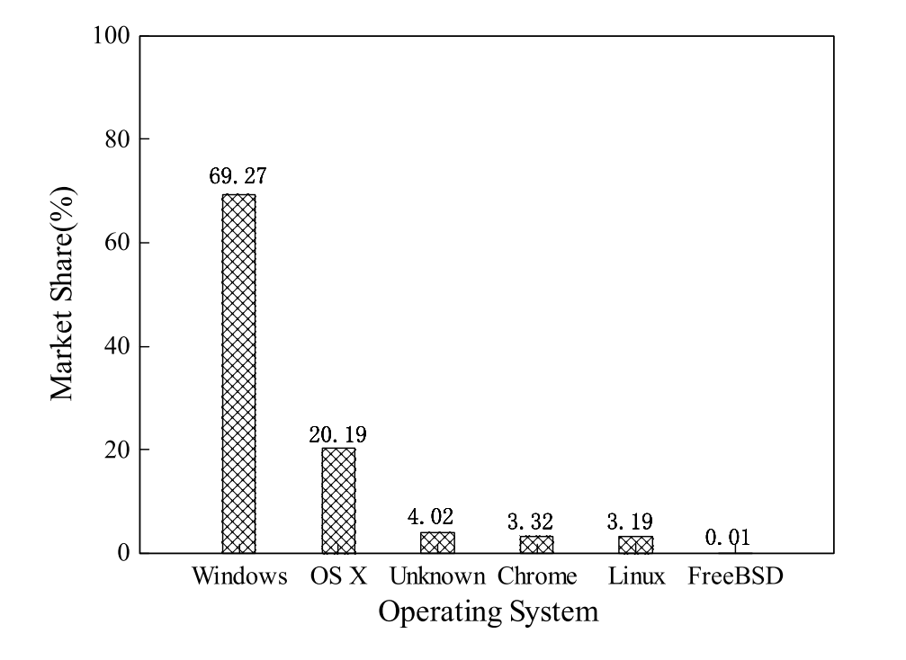

- In summary, we make the following contributions:
- We find that the official API documentation is an unexplored and effective information source for Windows malware detection and design a documentation-augmented approach.
- We propose a novel dynamic Windows malware detection framework, namely DawnGNN, that utilizes the BERT-based semantic enhanced mechanism and graph neural network to perform malware detection.
- We adopt multiple API embedding techniques and GNN algorithms to verify the effectiveness and explore the best performance of the proposed detection framework.
- We evaluate our approach on three public Windows malware benchmarks. Experimental results verify the effectiveness of our BERT-based semantic enhanced mechanism and design framework.
- The rest of the paper is organized as follows. Section 2 presents the background about Windows malware and API. Section 3 detailed describes the system design of DawnGNN. Section 4 discusses the experimental results. Section 6 summarizes the related works. Section 5 presents the limitation of DawnGNN. The conclusion of this work is provided in Section 7.
- **2. Background**
- In this section, we discuss the threats of Windows malware and introduce the API with official documentation.
- **2.1. The threats of windows malware**
- According to the StatCounter website statistical data, Windows, developed by Microsoft, stands as the most widely used and widely distributed desktop operating system [23]. The market share distribution for the desktop operating systems is shown in Fig. 1. Consequently, the popularity and widespread usage of the Windows operating system (OS) make it an attractive target for cybercriminals. Malware targeting the Windows platform has increased enormously in recent years. According to AV-TEST statistics [24], until September 2023, the count of Windows malware samples has reached 1.07 billion.

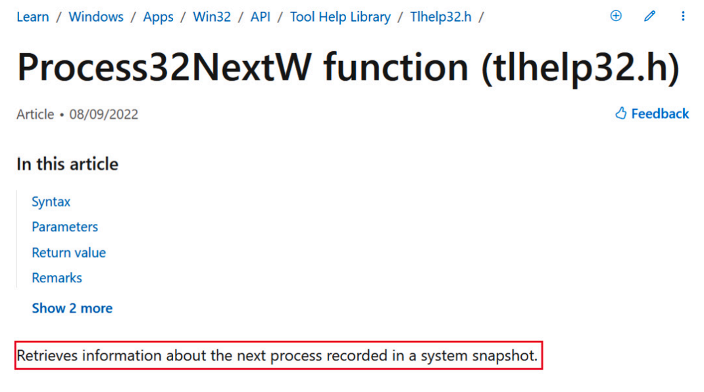

- Windows malware mainly includes the following categories: Virus. A computer virus usually hides within another seemingly harmless program and generates copies and inserts them into other programs. Worm. A worm usually performs as stand-alone malware and actively propagates itself via networks to infect other files or computers. Rootkits. Rootkits can remain hidden by altering the system settings of targeting OS and making the harmful processes invisible to normal users. Backdoor. A backdoor allows attackers to gain unauthorized remote access to a victim’s computer to bypass its protection mechanisms. Trojan horse. A Trojan horse usually camouflages as a regular, benign program or utility to mislead victims and activates hidden destructive functions when the application starts. Ransomware. Ransomware mainly focuses on demanding a ransom from the victims by encrypting key files or locking the whole system to prevent access.
- **2.2. Windows API with official documentation**
- The Windows API is an important part of the Windows OS and plays a key role in connecting Windows-based programs with Windows kernel and hardware [25]. The collection of all API functions is known as Win32 API. Apart from some console programs, all Windows programs can interact with Windows API and access predefined tasks such as opening and closing a file, displaying a prompt dialog box, storing computation results to files, and accelerating task processing via starting multiple threads. The system resources like file systems, processes, threads, network communication, and devices, are unified and managed by the OS kernel, and programs need to employ Windows API to accomplish their tasks. All available API functions are provided via dynamic link libraries, i.e., in .dll files, and commonly used libraries include Kernel32.dll, User32.dll, and GDI32.dll. The extraction and analysis of API calls are useful in determining the behavior and functions of a program.
- We find that the official API documentation contains the semantic description for API functionality and carries more information than the API name, which can be used to enhance current API call-based Windows malware detection methods. The API Process32NextW is one representative potentially malicious API call [26]. Its partial official documentation is shown in Fig. 2. From Fig. 2, the sentence “Retrieves information...” in the red box can accurately describe the API functionality, which can also be used for semantic representation in Windows malware detection. In this paper, we design a documentationaugmented Windows malware detection framework to verify the effectiveness of API documentation. In addition, we leave the inclusion of semantic information for other auxiliary descriptions within the documentation page like parameters, and return values in malware detection as future work.
- **3. System design**
- The goal of DawnGNN is to leverage the official API documentation information for enhancing dynamic Windows malware detection using graph neural network and the BERT model. Fig. 3 shows the overall architecture of DawnGNN, which consists of three components, namely, API Graph Constructor, API2Vec Embedding Layer and GNN Classifier. Firstly, the API graph constructor leverages Cuckoo Sandbox [27] to perform automatic dynamic analysis on Windows Portable Executable (PE) programs to extract API call sequences. API calls, indicating the interactions between programs and system resource usage, are widely used to make unified behavior representations for malware detection. Then, it adopts structural dependencies within API sequences to build API graphs. Next, the API2Vec embedding layer generates API attributes by encoding official API documentation via the BERT-based language model. Finally, GNN is adopted to learn contextual information from attributed API graphs for performing effective malware detection.
- **3.1. API graph constructor**
- After obtaining the run-time API call sequences from Windows PE programs, this component converts the call sequences into graphs to capture the structural dependencies between APIs. Formally, given a set of API sequences, each program is represented as a graph 𝐺 = {𝑉 ,𝐷}, where 𝑉 is a set of nodes and 𝑣 ∈ 𝑉 denotes a unique API call, and 𝐷⊆V × 𝑉 represents a set of directed edges, where an edge 𝑣⃖⃖⃖⃖⃖⃖⃗ 𝑖𝑣𝑗 indicate a sequential connection between API calls. The attr      ribute matrix is defined as 𝑋 = {⋯;𝑥𝑖;⋯; }, where 𝑥𝑖 is the attribute of 𝑖-th node. The adjacency matrix of graph 𝐺 is represented as 𝐴 ∈ ℤ𝑁𝐺×𝑁𝐺 , where 𝑁𝐺 is the count of all API nodes. Thus, the API call graph maintains all API calls with their sequence information.
- To construct the graph, we first collect API calls from all Windows programs as an API sequence set. Then, we construct the API graph by treating the sequence orders as call relationships, which could be improved by precisely API parameter matching. To further illustrate the process, Fig. 4 shows a segment of the collected API sequence from a sample of Trojan malware [28], which is often disguised as legitimate software and performs unauthorized behaviors. The API sequence contains six API calls: ‘ntcreatefile’, ‘ldrgetprocedureaddress’, ‘setfileattributesw’, ‘getfileattributesw’, ‘mesageboxtimeouta’ and ‘ntterminateprocess’. In the API sequence, the API call ‘ntcreatefile’ is followed by ‘mesageboxtimeouta’, which means a directed edge is created from the ‘ntcreatefile’ node to ‘mesageboxtimeouta’ node.
- **3.2. API2Vec embedding layer**
- In this paper, we generate API embeddings via learning semantic information from crawled official Windows API documentation. In addition, attributes like the parameters of the API function, the location of the API within its sequence, and code semantic characteristics within the API implementation, can be easily added to the node attribute to further improve malware classification performance. The pre-trained BERT model [21] has been proven to be effective in various NLP tasks, which is suitable for processing API documentation. Firstly, we design a semi-automatic method to crawl API documentation from the official website1 via analyzing the website page layout structure. These documents briefly summarize the functionality of every API in nature language, which represents an effective information source for semantic information extraction. Then, the BERT model has the ability to generate API embeddings directly from these language descriptions.

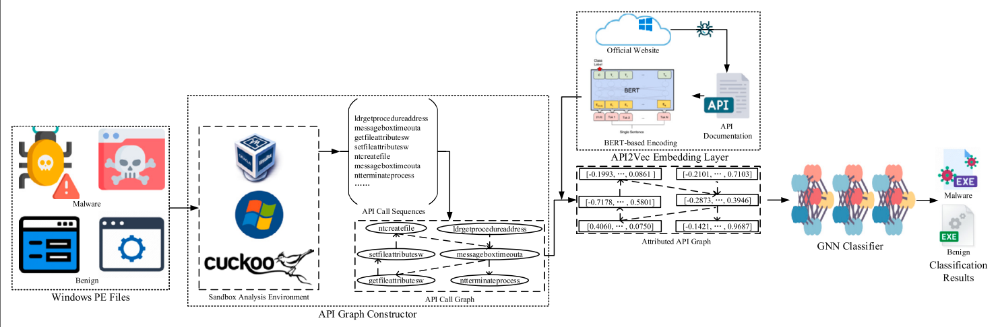

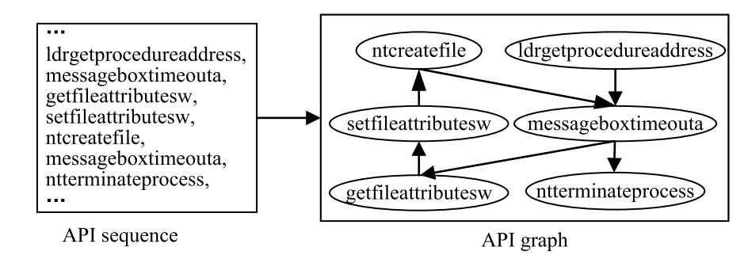

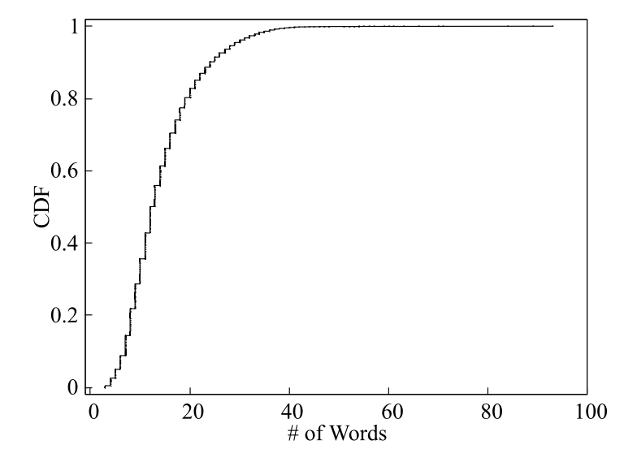

- After manually analyzing the official API website, we found that most websites share similar layout structures. Thus, we developed XML Path Language (XPath) parser scripts to extract all API names with corresponding description documentation. To counter the complex anti-crawl mechanism of the Microsoft website, we manually save the website page covering all API categories. Next, we parse the category website to collect every API category Uniform Resource Locator (URL). Then, the API category URL is iteratively parsed to collect header file URLs for API documentation extraction. Finally, we obtain the most API documentation without sparse distribution cases, like Windows driver API or out-of-date API. For the remaining API, we manually search online to collect the description. Finally, we crawled 32763 Windows APIs with corresponding description documentation. We plot the distribution of the number of words for Windows API documentation in Fig. 5, which exhibits great diversity and contains sufficient information. We also plot the word cloud of Windows API documentation in Fig. 6, which covers the main functionality provided by Windows OS.
- After building the API documentation corpus, we leverage the pretrained BERT model to capture the features and encode the semantic representation of each Windows API. In order to learn the context relationships between different words within the API documentation, we perform the masked language model (MLM) task. We present the detailed process of the MLM task for API documentation in Fig. 7. The [CLS] and [SEP] tags are added to the API documentation, which repreFig. 6. Word cloud of Windows API documentation. sents the beginning of sentences and sentence separation respectively. In one API description, eighty percent of the chosen words are masked by [MASK] (mask-out tokens), ten percent are kept unchanged, and the remaining ten percent are replaced with other words (corrupted tokens). Then, the multi-layer bidirectional transformer encoder within BERT processes the input, predicts the masked-out tokens, and outputs a probability for a particular token 𝑡 = [MASK] via a fully connected layer followed by the last transformer encoder. The cross-entropy loss function is formalized as: 𝐿𝑏𝑒𝑟𝑡(𝜃𝑏)=−∑𝑀 𝑖=1 log(𝑚 = 𝑚𝑖|𝜃𝑏), 𝑚𝑖 ∈ [1, 2, ...,|𝑀|],
- where 𝜃𝑏 represents the parameters of the transformer encoder and output layer within BERT, and 𝑀 denotes the collection of masked tokens during the training phase. In each self-attention layer within BERT, an input token updates its embedding by computing the attention weights with other connected tokens’ embeddings. In this way, each token’s embedding captures context-sensitive semantic information and changes with its location and context. Thus, the BERT model can learn the semantic information of API documentation. When pre-training is completed, we input the API’s corresponding official functionality description into the BERT model and treat the hidden state of the last layer as the semantic embedding of that API.
- Specifically, the original API documentation contains additional words such as the API name “The NotifyAddrChange function...”, abbreviations “(ARP)”, annotations “(Unicode)”, etc., which are meaningless to the functional description and are not represented in nature language. We therefore remove these additional words to ensure that the BERT model could accurately capture the API semantic. Alternatively, we leverage the one-hot encoding and Word2vec static embedding mechanism to generate API node attributes directly from the collected API sequences. Next, we compare the BERT encoding mechanism with the above two mechanisms to highlight the importance of semantic information.

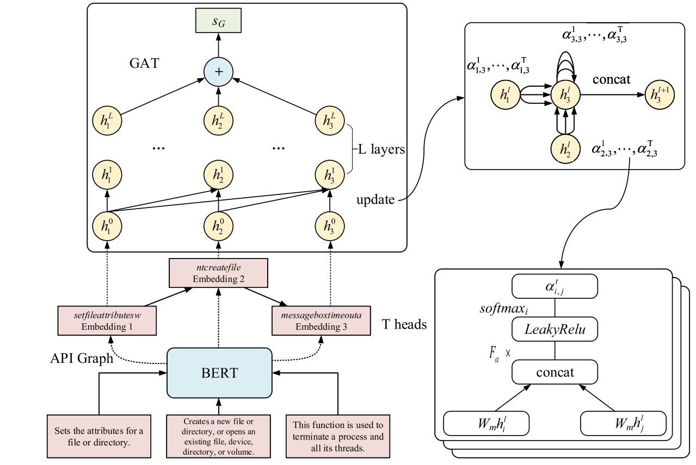

- **3.3. GNN classifier**
- After the processing of the API2Vec Embedding Layer component, we obtain a number of dynamic API graphs with corresponding node attributes. Then, the GAT [29] classifier is trained on these API graphs to extract the structural information and further perform Windows malware detection. GAT is a graph neural network based on an attentionbased message-passing mechanism. This attention mechanism allows GAT to adaptive allocate attention weights to neighbor nodes. Next, it leverages the weighted sum of neighbor nodes to update the representation of the current node. In addition, GAT has the advantage of strong generalization for directed graphs. The network structure of the GAT is shown in Fig. 8. As shown in Fig. 8, at first, each API’s official documentation within the API graph is fed into BERT to extract semantic embedding. Then, the API node embeddings and API graph structure are used as the input of GAT to compute graph embedding with structure and semantic information. During the iterative process of every layer within GAT, the semantic embedding of an API node is passed to its neighbor nodes. With the help of the multi-head attention mechanism, each API node can focus on more critical neighbor nodes. Given two connected API nodes 𝑖 and 𝑗, the attention weight 𝛼 at attention head 𝑡 and 𝑙-th layer structure is calculated according to the following formula:

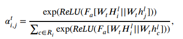

- where ℎ𝑙 denotes the hidden representation of an API node at the 𝑙- th layer, ℎ0 equals the semantic embedding of an API node generated by the BERT model, 𝑊𝑚 represents the learnable parameters at 𝑡-th attention head, 𝐹𝑎 is a feedforward neural network, ReLU indicate the rectifier activation function, || denotes the concatenation operation, and 𝑅𝑖 represents the neighbor nodes of API node 𝑖. Then, the update process of each API node’s embedding based on the attention mechanism is formalized as follows:

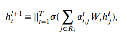

- where 𝑇 denotes the number of attention heads, 𝑡 represents the 𝑡-th attention head. Finally, GAT updates the API node embeddings of the API graph and sums the graph semantic embedding 𝑠𝐺 as follows: 

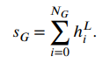

- The final prediction classification is performed via a Multilayer Perceptron (MLP) model, which can be represented as:

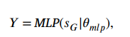

- where 𝜃𝑚𝑙𝑝 denotes the learnable parameters of MLP model, 𝑌 represents the final classification label malware or benign. In this paper, we leverage the GNN model to generate graph embedding [30] via encoding all node hidden representations and graph structure information into low-dimensional space. The node hidden representation is transformed from aggregating local neighbor node information. DawnGNN also adopts Graph Convolutional Network (GCN) and Graph Isomorphism Network (GIN), and compares their performance to identify the most effective mechanism in malware detection. GCN is another representative GNN, where node hidden representation is calculated via the following formulas:

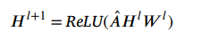

- where 𝐻𝑙 indicates the hidden representation matrix at the 𝑙-layer for all nodes, and 𝐻0 denotes the all API node embeddings generated by the API2Vec Embedding Layer component. 𝑊 𝑙 is the learnable weight parameters of the 𝑙-layer GCN. 𝐴̂ = ��̃ − 1 2 𝐴̃𝑀̃ − 1 2 , where 𝑀̃ denotes the degree matrix, and 𝐴̃ = 𝐴 + 𝐼𝑠. 𝐼𝑠 is the identity matrix. GIN adopts     s an MLP model to aggregate comprehensive information, which is formalized as:

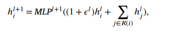

- where 𝜖𝑡 represents scalar learnable parameters.
- **4. Experiments and evaluation**
- In this section, we comprehensively evaluate our proposed system DawnGNN via various experiments. In the following, we first describe the experiment settings and dataset used in DawnGNN. And then, we discuss the results of our experiments.
- **4.1. Experimental setup and dataset**
- The proposed framework DawnGNN was implemented and tested on a computer running Ubuntu 20.04 (64-bit) with Intel(R) Core (TM) i7-12700 CPU @ 2.10 GHz, 16.0 GB RAM, NVIDIA RTX 3060, and 512 GB for the hard disk drive. DawnGNN was implemented in Python programming language version 3.8.10 with PyTorch 2.0.0 and Transformers 4.28.1 framework and other libraries such as Scikit-learn, Numpy, Pandas, and Requests have been also used. The framework takes sequences of API calls extracted from Windows exe files as input.

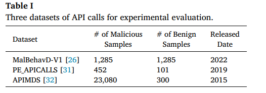

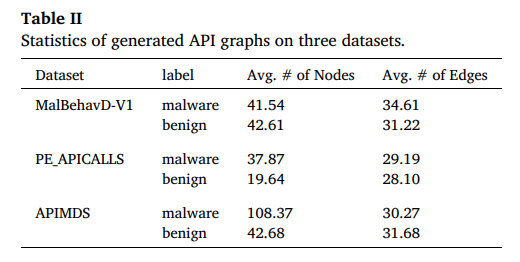

- We collected three existing datasets of malicious and normal API calls for our experimental evaluation. The information of these datasets is summarized in Table I. As described in Section 3.1, we generate API graphs based on collected run-time API call sequences. The statistics of generated API graphs on three datasets are shown in Table II. From Table II, we can observe that the API graphs are sparse forms, which is suitable for graph classification tasks. Using different datasets allows us to evaluate the malware detection performance of DawnGNN from multiple dimensions. Specifically, we randomly shuffle the dataset and split 80% for the training, 10% for validation, and the rest 10% for testing. 
- **4.2. Measure metrics**
- We evaluate the Windows malware detection performance of DawnGNN with the following five metrics: precision, recall, true negative rate, accuracy, and F1-score. These metrics are computed via true positive (TP), true negative (TN), false positive (FP), and false negatives (FN). In the Windows malware detection scene, TP denotes the count of correctly identified malicious exe files, and TN denotes the count of correctly detected benign exe files. FP indicates the count of misidentified malicious exe files, and FN denotes the count of missed malicious exe files. The above measure metrics are calculated as follows:

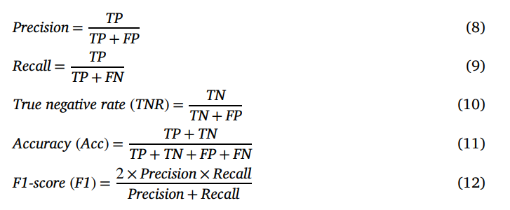

- **4.3. Performance of malware detection**
- In this paper, DawnGNN performs Windows malware detection via graph neural network and BERT-based semantic enhanced mechanism. Therefore, in this experiment, we comprehensively evaluate the effectiveness of the two main components.

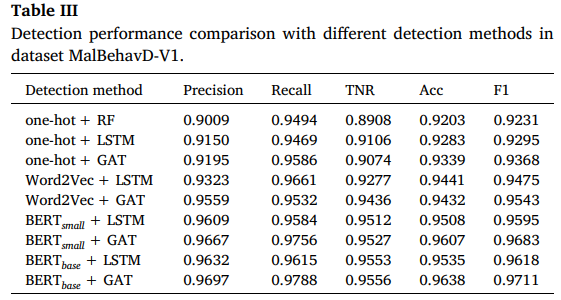

- The BERTsmall and BERTbase represent different versions small and base of the pre-trained BERT encoding mechanism.
- Firstly, we compare the BERT-based encoding mechanism with onehot and Word2Vec-based encoding methods to highlight the effectiveness of semantic information extracted from API documentation. In the one-hot encoding method, each API call is transformed into a binary vector where each position represents a unique API call. The dimension of the binary vector is equal to the count of all collected APIs. In the Word2Vec-based encoding method, we treat each API call as a word and use a neural network model to learn word associations from a large set of API sequences.
- Next, we compare the graph feature-based detection method with the statistical and sequence feature-based detection methods to illustrate the effectiveness of the design of graph feature learning. We combine the one-hot vector representation of API call sequences with the Random Forest (RF) model as the statistical feature-based detection method. We leverage the long short-term memory (LSTM) model to handle API sequences, which constructs the typical sequence feature-based detection method. In particular, the LSTM model requires API encoding mechanisms before inputting API sequences, which could be one of the three encoding mechanisms.
- Specifically, we compare the detection methods mentioned above in the symmetric dataset MalBehavD-V1. We set the Word2Vec and RF algorithms in the default setting. For the BERT-based encoding mechanism, we select the base and small versions according to our experiment environment. Specifically, we perform the MLM task on the collected official functionality descriptions with bert_base_uncased and bert_small as the initial pre-trained model and extract the last hidden layer as the API embedding. The dimensions of the generated API embeddings are 512 and 768, respectively. As there are multiple versions of the BERT model and many variant models, such as RoBERTa [33] and SENTENCE-BERT [34], we leave the exploration of the optimal encoding mechanism as a future work. For LSTM, we refer to the parameter settings within the existing detection method [35].
- The Windows malware detection performance with different encoding mechanisms and feature structures are shown in Table III. From Table III, we can observe that our BERT-based semantic enhanced mechanism improves the malware detection performance under every type of learning model. This illustrates that API documentation contains rich semantic information for identifying Windows malware. The BERT in base version outperforms the small version, which illustrates that larger API embeddings carry more precision semantic information in our API documentation encoding case. In addition, the pre-trained BERT model has the ability to extract context-sensitive information from API documentation. From Table III, we can also observe that the graph feature learning method is superior to the statistical and sequence feature-based methods, in each of the three encoding mechanisms. This illustrates that the graph feature-based method considers the structure information, improving the detection performance compared to the method that only considers sequence or statistical information
- We also evaluate the effectiveness of DawnGNN with different encoding mechanisms in datasets PE_APICALLS and APIMDS. The Windows malware detection performance in the two datasets is shown in Table IV. From Table IV, we can observe our BERT-based encoding mechanism improves the malware detection performance in the two imbalanced datasets via semantic information extracted from API documentation. In the two datasets, the TNR is lower when compared with Precision and Recall. This is caused by that the count of the malware is far beyond the count of the benign. In addition, the model cannot characterize benign patterns without enough samples.
- **4.4. Comparison of GNN algorithms**
- In this section, we explore the influence of multiple GNN algorithms on Windows malware detection performance.
- We tune hyper-parameters that significantly affect the detection performance according to domain knowledge to choose the optimal detection performance. The experiment is conducted on the dataset MalBehavD-V1 to eliminate the interference of imbalanced samples. The search range of hyper-parameters and optimal values for three GNN models are shown in Table V. From Table V, we can observe that the three GNN algorithms achieve the best performance at 100 epochs with a batch size of 128 and a learning rate of 0.0001. The number of graph neural network layers is all in multi-layers when generating the best performance. The optimal hidden dimensions for the three models are 32 for GCN, 16 for GIN, and 12 for GAT The neural networks’ hidden dimensions achieve the best performance when GCN is 32, GIN is 16, and GAT is 12  
- We compare the detection performance of DawnGNN by using three representative GNN algorithms: GCN, GIN, and GAT. The detection performance comparison of three GNN algorithms is shown in Table VI. From Table VI, we can observe that GAT provides the best detection performance. The experiment results show that DawnGNN with GIN exhibits superior detection performance over GCN, which illustrates that the adaptation of the powerful message aggregation function MLP leads to the improvement of GIN when compared with GCN. The GAT algorithm employs an attention mechanism to adaptive aggregate important information from neighbor nodes. In addition, the ability to handle directed graphs makes GAT more suitable for API graph scenes. Therefore, the DawnGNN with GAT achieves the best performance when compared with GIN and GCN. We also plot the detection performance variation rule with epochs in Fig. 9 to observe fluctuations in detection performance. From Fig. 9, we can observe that our proposed Windows malware detection framework achieves good performance on all three GNN algorithms. This illustrates that the combination of GNN models and BERT-based enhancing mechanisms is promising in Windows malware detection.
- **4.5. Comparison with other approaches**
- In the following, we compare DawnGNN with existing Windows malware detection approaches to verify the effectiveness of our proposed detection performance on public datasets
- We examine the performance of the DawnGNN framework against other existing detection approaches based on API call sequences extracted from exe files and comparative results are presented in Table VII. First, we compare DawnGNN against MalDy [36] and MalDetConv [26] on dataset MalBehavD-V1 and PE_APICALLS. MalDy proposed to leverage h-grams, feature hashing, and Term Frequency– Inverse Document Frequency (TF-IDF) to vectorize the behavior reports. Then, an ensemble prediction framework is constructed to perform precise malware detection. MalDetConv designed a new automated behavior-based detection framework, which constructs a hybrid of Convolutional Neural Network (CNN) and Bidirectional Gated Recurrent Unit (BiGRU) models to perform high dimensional representations of API call sequences and then leverages a fully connected neural network module for malware detection. On dataset MalBehavD-V1, DawnGNN achieved the detection accuracy of 0.9638, creating an improvement of 0.79% and 0.51% detection accuracy of MalDy and MalDetConv, respectively. The detection improvement of 2.44% and 1.89% were achieved by DawnGNN over the MalDy and MalDetConv framework using dataset PE_APICALLS, respectively. This illustrates the effectiveness of our BERT-based semantic enhancement and graph learning combination design in the Windows malware detection domain. On dataset APIMDS, most methods already achieve the detection accuracy of more than 99%. Although MalDetConv achieves the highest detection accuracy, DawnGNN also performs highly precise malware detection. In this paper, we design a documentation-augmented mechanism to verify the effectiveness of the semantic information extracted from the official API documentation. Experiment results from Table VII illustrate that our proposed DawnGNN reaches state-of-the-art malware detection performance.

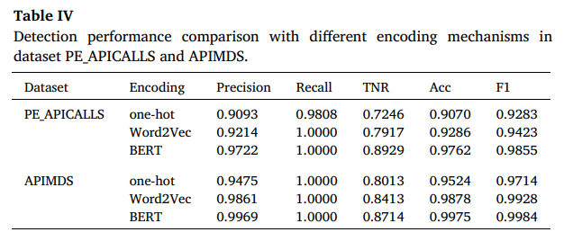

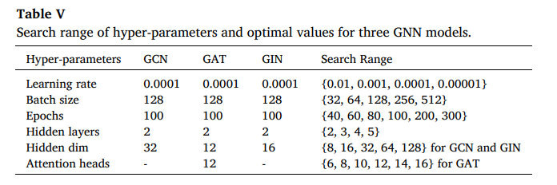

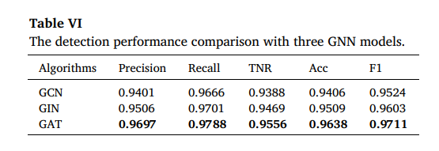

-**5. Discussion & limitation**
- In this paper, we focus on dynamic API-based malware detection and leverage API documentation information to enhance the Windows malware detection performance. Although our DawnGNN is useful and effective for detecting Windows malware, there is still improvement in our current implementation when compared with a large number of existing detection approaches. DawnGNN directly constructs API graphs from API call sequences to capture the structural dependencies. This coarse-grained graph construction mechanism can be improved by DMalNet [17], which builds precise API call graphs using additional API parameter matching. DawnGNN identifies malware via the unusual call contexts, which rarely occur among benign programs. For indistinguishable call contexts, additional run-time behavior information like API parameters and network activities [38] can be adopted to improve detection performance. Malware could leverage concealmentbased evasion method [39], such as environment analysis, delayed execution, conditional execution, etc., and disguise as benign programs to evade dynamic analysis. This could be mitigated by X-Force [40], which leverages the forced execution technique to increase the coverage of dynamic analysis. In addition, APT malware leverage Living-Off-The-Land techniques [41] to conduct nefarious actions, which could be resisted by provenance graph-based APT detection methods [42]. Our graph learning-based detection framework is inherently affected by adversarial attacks [43], which could be fought against by more robust learning methods [44].

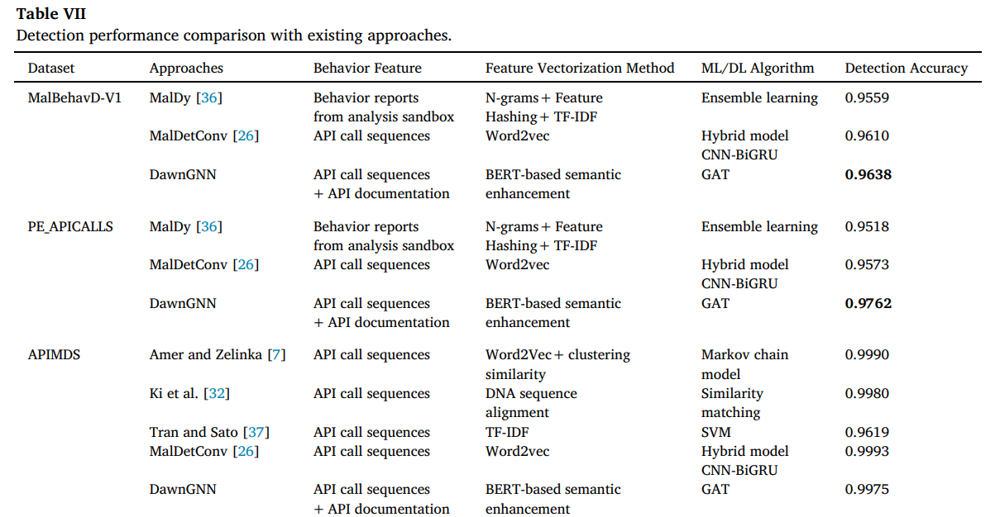

- Except for API category and parameter information [14–16], the official API documentation is another unexplored information source. Therefore, we crawl API documentation from Microsoft’s official website and leverage the BERT model to extract semantic information, which could be complementary to existing Windows malware detection approaches. Mal-Bert-GCN [18] built directed process graphs from raw API sequences and employed GCN to perform malware detection. Similarly, our BERT-based semantic enhanced mechanism is orthogonal to inter-process interaction information. In this paper, we only extract the functional descriptions for an API call to extract semantic information. Other numerous descriptions, including parameters, return value, remarks, and requirements, are potential useful information sources for malware detection when considering the boom in large language models [45]. We leave the design of a more comprehensive detection framework via deeply digging semantic information from API documentation as future work. 
- Our documentation-augmented malware detection framework is based on the classic BERT-based encoding mechanism and standard GNN algorithm. The encoding mechanism could be improved by the large version or other optimized models, such as RoBERTa, ALBERT [46], DistillBERT [47], etc. The standard GNN algorithm could be improved by jumping knowledge networks [48], self-supervised learning mechanisms [49], or other superior graph learning algorithms [50]. We leave the exploration of the optimal encoding mechanisms and graph learning models as future work for performing highly precision malware detection. We verify the effectiveness of the proposed semantic enhanced mechanism on three publicly available dynamic malware datasets. We plan to make stronger experiment validation when obtaining more recent and diverse datasets. The semantic enhanced mechanism could be complementary to enhance current Windows malware detection methods. We leave the enhancement validation as future research with open source or re-implementation versions of current detection methods. In addition, the combination design of graph neural network and BERT-based semantic enhanced mechanism can also be applicable to malware detection in other platforms, like Android and Linux. The design of bringing in external software operation knowledge is promising in the malware detection domain.
- **6. Related work**
- This section provides a detailed discussion of relevant literature ondynamic Windows malware detection and BERT-based security detection methods.
- **6.1. Dynamic windows malware detection**
- The dynamic method executes a program in a controlled environment which observes the execution status of the program and then determines whether it has malicious behaviors by examining API calls, network traffic, and other critical characteristics. API calls can provide valuable run-time information for identifying malicious activities. Therefore, researchers have proposed a lot of API call-based detection approaches.
- Researchers have focused on extracting more effective features from API call sequences to perform malware detection for a long time. Fang et al. [51] use a hash function to encode the API call names, return values, and module names for obtaining more detailed behavior information. Agrawal et al. [52] perform one-hot encoding on API call sequences and n-gram encoding on API parameters. Unfortunately, these approaches only consider partial parameters or treat all parameters as strings, which cannot fully explore the information from various parameters. Zhang et al. [10] employ different hashing strategies to encode API names and various parameters, which still cannot express semantic information. Rabadi and Teo [53] divide the API parameters into multiple representation sets before applying feature hashing, which may lead to the loss of distinction
- Many studies have applied ML and DL models to analyze API call sequences. Qiao et al. [54] leverage frequent itemset mining and similarity calculation to process the API names and parameters within API call sequences. Uppal et al. [8] select the important feature via frequency statistics from API call sequences, and then employ the Support Vector Machine (SVM) classifier to perform malware detection. The above methods ignore the relationship between API calls and can be easily evaded by modifying the frequency counter value. Daht et al. [55] employ n-grams to process the system API call sequences and then leverage the logistic regression and shallow neural network classifier to perform malware classification. Ndibanje et al. [56] construct feature vectors from API sequences and employ similarity-based statistics methods to detect malware. Zhang et al. [57] construct API relationship graphs to represent the internal relationships among various programs. Then, they leverage the knowledge graph embedding algorithm to input the API graphs into RF, Model Pool, SVM, and Deep Neural Network (DNN) to perform malware detection. Pascanu et al. [58] employ Recurrent Neural Networks (RNNs) to capture sequence relations between APIs and feed the outputs of RNNs into a max-pooling layer for malware classification. kolosnjaji et al. [9] leverage CNN to process consecutive API sequences and apply LSTM to handle time-series dependence. Agrawal et al. [52] propose to construct several stacked LSTMs to process API names and string parameters. Zhang et al. [10] design a hybrid deep learning framework including gate-CNNs and Bi-LSTM to process API names and parameters for performing malware detection. Researchers try to transform the API call sequences into graphs to capture the direct or indirect relationship between API calls. Jiang et al. [59] transform the API sequences of exe files into a call graph by matching the callercallee relationships. Then, graph embedding techniques and stacked denoising autoencoders are combined to perform malware detection. Amer and Zelinka [7] leverage contextual similarity in API sequences to cluster APIs, and employ the Markov chain to capture relationships and perform malware detection. In this paper, we combine the GNN model and BERT-based semantic enhancement mechanism to classify API graphs and perform effective Windows malware detection.
- **6.2. BERT-based security detection**
- BERT has emerged as a powerful natural language processing model that is capable of learning bidirectionally contextual representations. With great success in various language tasks, the BERT model has been applied in security detection domains, such as malware detection [60], vulnerability detection [61], and malicious traffic detection [62], etc. MalBert [63] and Badr et al. [60] design a BERT-based framework to perform Android malware detection and classification from elements extracted from Android Manifest file. SmartConDetect [61] proposes to extract code fragments via a static analysis tool and then feed them into a pre-trained BERT model to perform vulnerability detection in smart contracts. BINSHOT [64] designs a BERT-based similarity learning architecture to perform effectively binary code similarity detection. The architecture adopts a weighted distance vector with a binary cross entropy as a loss function. ET-BERT [62] proposes a new BERT-based encrypted traffic representation model, which could capture deep contextualized datagram-level representation from large-scale unlabeled data and perform effective malicious traffic detection. Enimanal [65] proposes a specialized BERT model, which leverages the declarations within the Linux manual to extract semantic information for each system call, and then utilizes GNNs to perform cross-architecture IoT malware analysis. CoDOC [22] proposes a fusion framework to accurately identify sensitive Android source and sink methods. This framework leverages graph learning to encode source code information and a BERT-based model to extract semantic information from Android documentation. Similarly, in this paper, DawnGNN crawls the official Windows API documentation and leverages a BERT-based semantic extraction mechanism to enhance malware detection.
- **7. Conclusion**
- In this paper, we propose a novel dynamic Windows malware detection system using graph neural networks and a BERT-based semantic enhancement mechanism, called DawnGNN. It constructs API graphs directly from API call sequences and leverages the BERT-based model to extract API semantic information from official API documentation. By feeding the semantic information of API nodes and the directed API graphs into the GAT, DawnGNN performs effective Windows malware detection. On three public datasets, we verify that our BERT-based encoding mechanism improves the detection mechanism compared with one-hot and Word2Vec-based encoding mechanisms, and DawnGNN outperforms other traditional detection methods only using raw API call sequences. In addition, we find that the official API documentation is an unexplored informative source and the BERT-based documentation augmented mechanism is promising in Windows malware detection